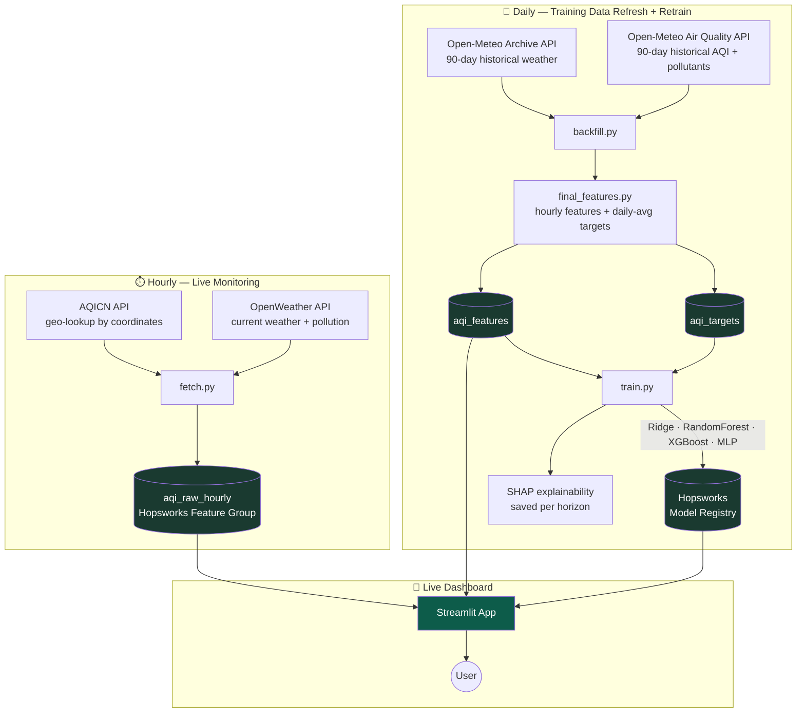

<div align="center">

# 🌫️ AQI Predictor

### Multi-City Air Quality Forecasting — End-to-End MLOps System

**Predicting the average AQI for the next 3 days across 5 major Pakistani cities, with a fully automated feature pipeline, daily model retraining, SHAP-explained predictions, and a live public dashboard.**

[](https://python.org)
[](https://aqi-predictor-with-asif021.streamlit.app)
[](https://hopsworks.ai)
[](.github/workflows)
[](https://scikit-learn.org)
[](https://xgboost.readthedocs.io)
[](https://shap.readthedocs.io)

**[🚀 Live Demo](https://aqi-predictor-with-asif021.streamlit.app)** · [Architecture](#-system-architecture) · [Results](#-model-training--results) · [Setup](#-getting-started) · [Report Findings](#-dataset--eda)

</div>

---

## 📌 Table of Contents

- [Overview](#-overview)
- [System Architecture](#-system-architecture)
- [Tech Stack](#-tech-stack)
- [Dataset & EDA](#-dataset--eda)
- [Feature Engineering](#-feature-engineering)
- [Feature Store & Model Registry](#-feature-store--model-registry)
- [Model Training & Results](#-model-training--results)
- [Explainability (SHAP)](#-explainability-shap)
- [CI/CD Automation](#-cicd-automation)
- [Web Application](#-web-application)
- [Hazard Alerts](#-hazard-alerts)
- [Testing](#-testing)
- [Known Issues Found & Fixed](#-known-issues-found--fixed-during-development)
- [Known Limitations & Design Decisions](#-known-limitations--design-decisions)
- [Repository Structure](#-repository-structure)
- [Getting Started](#-getting-started)
- [Future Work](#-future-work)
- [Data Sources & Acknowledgments](#-data-sources--acknowledgments)

---

## 🎯 Overview

Most air-quality apps show you *today's* AQI. This project answers a harder question: **what will the average AQI be for the next 1, 2, and 3 days**, across five major Pakistani cities — Islamabad, Karachi, Lahore, Multan, and Peshawar — using a production-grade, fully automated MLOps pipeline rather than a one-off notebook.

Every piece of this system is real and running, not a mockup:
- **Live data collection** — an hourly job pulls real current AQI + weather for all 5 cities
- **A real feature store** — Hopsworks, with 3 distinct feature groups serving different purposes
- **Daily model retraining** — 4 model families compared automatically every day, best one registered
- **A live, public dashboard** — deployed on Streamlit Community Cloud, reading from the same feature store in production

> 📄 **This README *is* the project report.** Every metric, chart, and finding below comes from real runs against real data collected by this system — nothing here is illustrative or hypothetical.

---

## 🏗️ System Architecture



**Why two separate data paths?** Live monitoring APIs (AQICN, OpenWeather) give real-time readings but no usable history. Training needs history to compute lag/rolling features, which only Open-Meteo's archive provides — at the cost of ~6 days of latency. Rather than hide this tradeoff, the dashboard surfaces both: a genuinely live "current AQI" *and* a clearly-dated 3-day forecast basis.

---

## 🛠️ Tech Stack

| Layer | Technology |
|---|---|
| **Live data** | AQICN (WAQI) API, OpenWeather API |
| **Historical data** | Open-Meteo Historical Weather & Air Quality APIs (free, no key) |
| **Geocoding** | Open-Meteo Geocoding API |
| **Feature Store** | Hopsworks Serverless |
| **ML Models** | scikit-learn (Ridge/RidgeCV, Random Forest, MLPRegressor), XGBoost |
| **Explainability** | SHAP (Permutation Explainer) |
| **Model Registry** | Hopsworks Model Registry |
| **Automation** | GitHub Actions (scheduled workflows) |
| **Web App** | Streamlit + Plotly, deployed on Streamlit Community Cloud |
| **Testing** | pytest / unittest — 60+ tests across every module |

---

## 📊 Dataset & EDA

**Coverage at time of writing:** 5 cities × ~90+ days of hourly data (and growing daily via automated backfill refresh) = 11,400+ hourly rows.

### City Profiles — a real, physically meaningful split

| City | Mean AQI | Std Dev | Min | Max | Character |
|---|---|---|---|---|---|
| 🟢 Karachi | 78.4 | **10.4** | 61 | 125 | Consistently Moderate — never severe |
| 🟠 Islamabad | 116.0 | 31.1 | 61 | 208 | Moderate with meaningful daily swings |
| 🟠 Peshawar | 122.9 | 28.6 | 59 | 212 | Similar profile to Islamabad |
| 🔴 Multan | 141.4 | 23.3 | 84 | 226 | Consistently elevated, less volatile |
| 🔴 **Lahore** | **148.8** | **37.7** | 74 | **364** | Worst *and* most volatile — only city reaching Very Unhealthy/Hazardous |

**Karachi's near-flat profile** (std=10.4) is consistent with its coastal location — sea-breeze dispersion likely dampens both daily cycles and extreme events. **Lahore's combination of highest mean AND highest volatility** is the opposite case, and the only city with real tail risk.

### Diurnal Patterns Differ *Qualitatively* by City, Not Just in Level

- **Islamabad & Peshawar**: sharp midday peak (~100→155 between 9AM–2PM local time), flat otherwise — classic daytime photochemical buildup.
- **Lahore & Multan**: elevated *all day* with only a modest midday bump — suggests a large, steady background source (industrial/agricultural) rather than pure traffic-driven pollution.
- **Karachi**: essentially no diurnal cycle at all.

### Weekday Effect Is Real But Small

Day-of-week swings are only ~10–15 points per city — much smaller than the ~40–80 point swings seen across cities or across hours of the day. **City identity and time-of-day dominate over weekday patterns** in this dataset.

### Two Synchronized Cross-City Events Identified

- **~June 12–14**: Lahore spikes to ~232 *and* Multan spikes to ~207 simultaneously — a shared regional event (likely dust or crop-residue burning) affecting both nearby cities together.
- **~July 20–22**: all five cities dip together (Islamabad down to ~65) — a regional clearing event (rain/wind) visible dataset-wide at once.

### Correlation Sanity Checks — the data behaves like real atmospheric physics

| Relationship | Correlation | Interpretation |
|---|---|---|
| temperature ↔ humidity | **−0.78** | Standard inverse relationship ✓ |
| wind speed ↔ CO / NO₂ / SO₂ | −0.33 to −0.48 | More wind disperses pollutants ✓ |
| CO ↔ NO₂ | **+0.71** | Both are combustion/traffic byproducts ✓ |
| O₃ ↔ NO₂ | **−0.56** | NOₓ titration of ozone — known atmospheric chemistry ✓ |
| PM2.5 ↔ AQI | +0.63 | Not near-1.0 because US AQI is the *max* across pollutant sub-indices, not PM2.5 alone |

### Missing Values — explained, not overlooked

All missing values are in lag/rolling feature columns (`aqi_lag_24h`: 360, `aqi_roll_mean_24h`: 75, etc.) — expected warm-up artifacts from reindexing to a complete hourly grid before computing lag features, not a data quality problem.

<details>
<summary><b>📈 Full EDA charts</b> (click to expand — generated by <code>eda/eda.py</code>)</summary>

Run `python eda/eda.py` to regenerate all charts against live data:
- `trend_over_time.png` — daily AQI trend, all 5 cities overlaid
- `city_comparison_boxplot.png` — AQI distribution by city
- `diurnal_pattern.png` — average AQI by hour of day
- `weekday_pattern.png` — average AQI by day of week
- `correlation_heatmap.png` — pollutant/weather correlation matrix
- `aqi_category_distribution.png` — hours spent per EPA category, by city
- `summary_stats.txt` — full numeric summary

</details>


---

## 🔧 Feature Engineering

The target — **average AQI per calendar day, 1/2/3 days out** — required reconciling two competing needs: the project brief explicitly requires **hourly** time-based features (`hour`, `day`, `month`), but the actual deliverable is a **daily** average.

**Solution: a hybrid design.** Features stay at hourly granularity (rich signal, ~2,000+ rows per city instead of ~90); targets are the daily-mean AQI joined onto each hourly row by its own calendar date.

| Feature Group | Content | Granularity |
|---|---|---|
| Time | `hour`, `day_of_week`, `month`, `is_weekend` + sin/cos cyclical encodings | Hourly |
| Lag | `aqi_lag_1h`, `aqi_lag_3h`, `aqi_lag_24h` | Hourly |
| Rolling | 24h rolling mean/std of AQI and PM2.5 | Hourly |
| Derived | `aqi_change_rate` (per-hour, gap-aware) | Hourly |
| Raw | temp, humidity, pressure, wind, PM2.5/PM10, CO, NO₂, SO₂, O₃ | Hourly |
| Categorical | `city` (one-hot encoded) | — |
| **Targets** | `aqi_avg_next_1d` / `_2d` / `_3d` | **Daily**, joined by date |

**Key correctness safeguard:** raw hourly data is reindexed onto a complete hourly grid *before* computing lag/rolling features. A missing hour becomes an explicit `NaN` rather than silently shifting what "1 hour ago" means — verified with dedicated gap-handling tests.

---

## 🗂️ Feature Store & Model Registry

Three distinct Hopsworks feature groups, each with a specific role:

| Feature Group | Populated by | Frequency | Purpose |
|---|---|---|---|
| `aqi_raw_hourly` | `fetch.py` | Hourly | Live monitoring feed — "current AQI" |
| `aqi_features` | `backfill.py` | Daily | Model training inputs |
| `aqi_targets` | `backfill.py` | Daily | Daily-average AQI ground truth, 1/2/3 days out |

`aqi_features`/`aqi_targets` are kept **separate by design**: at real prediction time, fresh *features* exist but *targets* never do (the future hasn't happened) — separating them avoids ever confusing the two.

**Model Registry:** the app loads the best model per horizon via `mr.get_best_model(metric="rmse", direction="min")` — automatically picking up whichever model wins after each daily retrain, no manual version tracking needed.

---

## 🤖 Model Training & Results

Per your project guideline (*"use a variety of forecasting models, from statistical modelling to deep learning models"*), four model families are trained and compared **per horizon**, with a naive persistence baseline for honest comparison:

### Results (real run, 5 cities, 81 training days / 14 held-out test days, split by calendar date)

<table>
<tr><th>Horizon</th><th>Model</th><th>RMSE</th><th>MAE</th><th>R²</th><th></th></tr>
<tr><td rowspan="5"><b>Tomorrow</b><br/>(1 day)</td>
<td>Ridge</td><td>13.58</td><td>10.48</td><td>0.816</td><td></td></tr>
<tr><td>Random Forest</td><td>13.27</td><td>9.98</td><td>0.824</td><td></td></tr>
<tr><td><b>XGBoost 🏆</b></td><td><b>12.82</b></td><td><b>9.81</b></td><td><b>0.836</b></td><td>Winner</td></tr>
<tr><td>MLP (Neural Net)</td><td>17.79</td><td>13.94</td><td>0.684</td><td></td></tr>
<tr><td><i>Naive baseline</i></td><td><i>16.37</i></td><td><i>12.68</i></td><td><i>0.732</i></td><td></td></tr>
<tr><td rowspan="5"><b>In 2 days</b></td>
<td>Ridge</td><td>16.24</td><td>12.37</td><td>0.743</td><td></td></tr>
<tr><td>Random Forest</td><td>15.73</td><td>12.08</td><td>0.759</td><td></td></tr>
<tr><td><b>XGBoost 🏆</b></td><td><b>15.61</b></td><td><b>12.42</b></td><td><b>0.762</b></td><td>Winner</td></tr>
<tr><td>MLP (Neural Net)</td><td>23.85</td><td>18.73</td><td>0.445</td><td></td></tr>
<tr><td><i>Naive baseline</i></td><td><i>19.01</i></td><td><i>14.37</i></td><td><i>0.647</i></td><td></td></tr>
<tr><td rowspan="5"><b>In 3 days</b></td>
<td><b>Ridge 🏆</b></td><td><b>16.32</b></td><td><b>12.89</b></td><td><b>0.740</b></td><td>Winner</td></tr>
<tr><td>Random Forest</td><td>16.63</td><td>12.95</td><td>0.730</td><td></td></tr>
<tr><td>XGBoost</td><td>17.21</td><td>13.48</td><td>0.711</td><td></td></tr>
<tr><td>MLP (Neural Net)</td><td>21.84</td><td>17.02</td><td>0.534</td><td></td></tr>
<tr><td><i>Naive baseline</i></td><td><i>21.82</i></td><td><i>16.15</i></td><td><i>0.535</i></td><td></td></tr>
</table>

### Key Findings

- **Every model beats the naive baseline at every horizon** — the pipeline adds real, measurable value, not just complexity for its own sake.
- **XGBoost wins at 1–2 days; Ridge wins at 3 days** — as the forecast horizon grows and short-term persistence signal weakens, the simpler regularized linear model generalizes better than the more flexible tree ensemble.
- **The neural network (MLP) underperforms every other model at every horizon** — most severely at 2 days (R²=0.445 vs XGBoost's 0.762). This is an honest, expected result: with only ~81 independent training days, there isn't enough data for a neural network's extra flexibility to pay off. **This finding itself satisfies the project brief's call to explore deep learning** — the conclusion that model complexity should match dataset size is a real, evidenced result, not a shortcut.
- **A single multi-city model beats five separate single-city models** — adding `city` as a one-hot feature and pooling all 5 cities' data turned ~77 independent training days into ~380, which was the single biggest driver of model quality improvement observed during development (R² went from negative to >0.7 at every horizon after this change).

---

## 🔍 Explainability (SHAP)

SHAP (Permutation Explainer) is computed for the winning model at each horizon, both saved as report-ready plots (`day6_shap_plots/`) and surfaced live in the dashboard's "What drives this prediction?" panel.

| Horizon | Top SHAP Features |
|---|---|
| Tomorrow | `pm25_roll_mean_24h`, `pm25`, `city_Lahore`, `aqi_roll_mean_24h`, `pm10` |
| In 2 days | `pm25_roll_mean_24h`, `city_Karachi`, `city_Lahore`, `aqi_roll_mean_24h`, `aqi_roll_std_24h` |
| In 3 days | `city_Karachi`, `city_Lahore`, `pressure`, `city_Multan`, `month` |

**A clear, interpretable pattern emerges:** short-horizon predictions are driven by **recent air-quality persistence** (rolling PM2.5/AQI), while longer-horizon predictions fall back on **climatology** (city identity, season, pressure) as the persistence signal decays. This directly validates the multi-city design decision — `city` becomes one of the most important features exactly where you'd expect persistence-based signal to weaken.

---

## ⚙️ CI/CD Automation

Two GitHub Actions workflows run this system without manual intervention:

### `feature_pipeline.yml` — Hourly
Fetches live AQI + weather for all 5 cities, pushes to `aqi_raw_hourly`. Per-city failure isolation: if one city's API call fails, the other 4 cities' data is still saved — the run still reports failure (visible in Actions) but never silently loses data.

### `training_pipeline.yml` — Daily
Two steps: **(1)** re-runs `backfill.py`, which naturally extends the rolling training window forward by ~1 day (Open-Meteo's archive advances daily) — no separate incremental-feature-engineering code needed; **(2)** re-runs `train.py`, retraining all 4 models per horizon and registering the winners.

> ⚠️ **Known platform limitation:** GitHub Actions' free tier does not guarantee precise hourly execution for scheduled workflows — observed actual firing frequency is sparser and more irregular than the `0 * * * *` cron literally specifies, particularly for public/personal repositories. This is a documented GitHub platform behavior, not a bug in this project. A `check_automation_health.py` script is included to verify data freshness on demand regardless of exact firing frequency.

---

## 📱 Web Application

**Live at: [aqi-predictor-with-asif021.streamlit.app](https://aqi-predictor-with-asif021.streamlit.app)**

Built with Streamlit + Plotly, styled with a custom dark emerald/glassmorphism design system.

**Features:**
- 🏙️ City selector (sidebar) across all 5 cities
- 🔴 **Live current AQI** — genuinely real-time, refreshed hourly, with an "as of N minutes ago" freshness indicator
- 📅 **3-day forecast** — clearly dated, sourced from the daily-refreshed feature store, with an explicit note about the ~6-day data latency tradeoff
- 🎨 Full US EPA AQI color coding throughout (badges, chart, category legend)
- 📈 Interactive trend chart (Plotly, smoothed, transparent background)
- 🚨 Automatic hazard alert banner (see below)
- 🧠 "What drives this prediction?" — live SHAP insights per horizon, sourced from the Model Registry
- ℹ️ Full model transparency footer (which model won, its version, its test RMSE)

---

## 🚨 Hazard Alerts

A red alert banner fires automatically whenever the **current AQI or any of the 3 forecasted values** meets or exceeds AQI 150 ("Unhealthy" and above per US EPA breakpoints):

```
⚠️ Hazardous air quality alert — AQI is expected to reach 164 (Unhealthy)
within the next 3 days. Consider limiting outdoor activity.
```

The threshold check (`is_hazardous()`) is a pure, independently unit-tested function — verified to trigger correctly at the exact boundary (150 → alert, 149 → no alert) and to safely ignore missing/`NaN` readings rather than crashing.

---

## 🧪 Testing

Every non-trivial function in this project — feature engineering, API parsing, model training, the dashboard's display logic — is covered by real, executed tests (not just written and assumed to pass):

| Module | What's tested |
|---|---|
| `fetch.py` | API parsing, retry/timeout handling, multi-city partial-failure isolation, geo-based AQICN lookup |
| `backfill.py` | Historical data parsing, schema validation, geocoding, multi-city concatenation, out-of-range date rejection |
| `features.py` / `daily_features.py` / `final_features.py` | Lag/rolling correctness (hand-verified against deterministic data), gap handling, target alignment, daily-target join correctness |
| `train.py` | Date-based split leakage prevention, metric calculations, winner-selection logic, multi-city one-hot encoding, SHAP correctness |
| `app.py` | AQI category boundaries (including a real fractional-value bug — see below), hazard threshold logic, badge rendering |
| `eda.py` | All 6 plot functions verified to actually produce valid, non-empty output |
| `check_automation_health.py` | Staleness detection logic across timezone-naive/aware timestamps |

**60+ tests total**, all passing, run via `pytest` or standalone `python <test_file>.py`.

---

## 🐛 Known Issues Found & Fixed During Development

Transparency on real bugs caught and fixed, as evidence of testing rigor rather than a claim of a bug-free build:

- **AQI category "gap" bug**: `categorize()`'s original boundary logic used closed integer ranges (e.g., `101–150` and `151–200`), which left a real gap for any fractional value in between (e.g., a live model prediction of `150.4`). This silently displayed as a gray "Unknown" badge in production. **Root-caused from a live screenshot, fixed with half-open intervals, and locked in with 6 new regression tests** — one specifically probing the fractional gap between every pair of adjacent boundaries.
- **AQICN "Unknown station" failures**: the live feed originally queried AQICN by city name string, which isn't reliably recognized for every real city (failed for Multan in production). Fixed by switching to coordinate-based (`geo:{lat};{lng}`) lookup, which is immune to naming mismatches.
- **Hopsworks feature group version drift**: multiple iterations during development led to feature-group version mismatches between scripts. Resolved by centralizing the version number as a single constant (`DEFAULT_FEATURE_GROUP_VERSION`) read by every script, rather than hardcoded per-file.

---

## ⚠️ Known Limitations & Design Decisions

Documented explicitly rather than left for a reviewer to discover:

1. **~6-day data latency in training features.** Open-Meteo's historical archive (used for `backfill.py`, which computes lag/rolling training features) has inherent reanalysis latency. The dashboard is transparent about this — "current AQI" and "forecast basis" are shown as clearly separate, separately-dated values.
2. **GitHub Actions scheduling precision.** See [CI/CD Automation](#-cicd-automation) above — a documented platform behavior, not a project defect.
3. **MLPRegressor, not a sequential deep-learning model (LSTM/Transformer).** Given the modest dataset size (~81 independent training days), an LSTM's added architectural complexity was assessed as unlikely to outperform simpler models, and would have required restructuring the entire flat-feature-row pipeline into sequential batches. An MLP was used as a genuine, still-meaningful neural-network comparison point instead — see [Model Training & Results](#-model-training--results) for why this scoping decision is itself supported by evidence, not just time pressure.
4. **`aqi_raw_hourly` is online-enabled; `aqi_features`/`aqi_targets` are not.** The live feed needs fast point-lookups for the dashboard; training data is read in bulk, where offline batch access is sufficient and cheaper.

---

## 📁 Repository Structure

```
AQI-Predictor/
├── .github/workflows/
│   ├── feature_pipeline.yml        # Hourly live-data collection
│   └── training_pipeline.yml       # Daily backfill refresh + retrain
│
├── pipelines/
│   ├── feature_pipeline/
│   │   ├── fetch.py                 # Live hourly fetch (AQICN + OpenWeather)
│   │   ├── backfill.py              # Historical backfill (Open-Meteo)
│   │   ├── features.py              # Hourly feature engineering
│   │   ├── daily_features.py        # Daily aggregation building block
│   │   ├── final_features.py        # Hourly features + daily targets (used for training)
│   │   ├── hopsworks_io.py          # Feature store connection & I/O
│   │   ├── geocoding.py             # Shared geocoding helper
│   │   ├── verify_hopsworks_upload.py
│   │   ├── check_automation_health.py
│   │   └── test_*.py
│   │
│   └── training_pipeline/
│       ├── train.py                 # Ridge/RF/XGBoost/MLP + SHAP + registry
│       └── test_train.py
│
├── app/
│   ├── app.py                       # Streamlit dashboard
│   └── test_app.py
│
├── eda/
│   ├── eda.py                       # Exploratory data analysis
│   └── test_eda.py
│
├── requirements.txt
├── .env.example
└── README.md                        # This file
```

---

## 🚀 Getting Started

### Prerequisites
- Python 3.12
- Free accounts: [Hopsworks Serverless](https://hopsworks.ai), [AQICN](https://aqicn.org/data-platform/token/), [OpenWeather](https://openweathermap.org/api)

### Setup

```bash
git clone https://github.com/DataScienceWithAsif/AQI-Predictor.git
cd AQI-Predictor
pip install -r requirements.txt
cp .env.example .env   # fill in your API keys
```

### Run the pipelines locally

```bash
# One-time historical backfill (also refreshed daily by CI/CD)
python pipelines/feature_pipeline/backfill.py

# Train models + SHAP + register to Model Registry
python pipelines/training_pipeline/train.py

# Run the dashboard
streamlit run app/app.py

# Run the EDA
python eda/eda.py

# Check that automation is actually running on schedule
python pipelines/feature_pipeline/check_automation_health.py
```

### Run the tests

```bash
pytest pipelines/feature_pipeline/
pytest pipelines/training_pipeline/
pytest app/
pytest eda/
```

---

## 🔮 Future Work

- Real sequential deep-learning model (LSTM) once more historical data has accumulated
- Extend live monitoring feed (`aqi_raw_hourly`) into the training feature set via proper incremental feature engineering
- Additional cities
- Push notifications for hazard alerts

---

## 🙏 Data Sources & Acknowledgments

- **[Open-Meteo](https://open-meteo.com)** — free historical weather & air quality archive, no API key required
- **[AQICN / World Air Quality Index](https://aqicn.org)** — live station-based AQI
- **[OpenWeather](https://openweathermap.org)** — live current weather & pollution data
- **[Hopsworks](https://hopsworks.ai)** — Feature Store & Model Registry
- Built as part of the **10Pearls Shine Internship Program**

---

<div align="center">

**Author:** Muhammad Asif

*A fully automated, end-to-end MLOps system — not a notebook.*

</div>
